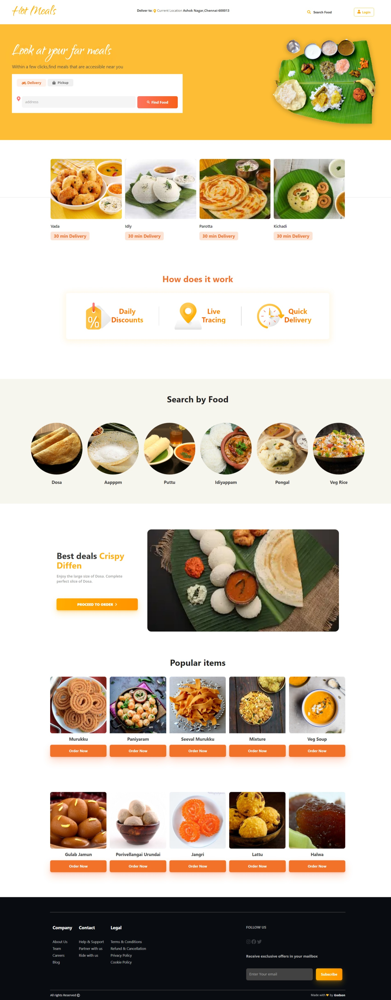

<!-- @format -->

# Food Landing Page

This is a food landing page project created as part of a task for Guvi. It's a simple web page designed to help users find nearby meals with ease. The project is built using HTML, CSS, and Bootstrap.

## Demo

You can see a live demo of the Food Landing Page [here](https://food-landing-pages1.netlify.app/).

## Screenshots



## Features

- User-friendly interface for finding nearby meals.
- Responsive design, making it accessible on various devices.
- Quick access to food delivery services.

## Getting Started

These instructions will help you get a copy of the project up and running on your local machine for development and testing purposes.

### Prerequisites

Before you begin, ensure you have met the following requirements:

- A web browser to view the page.
- A code editor for making changes (e.g., Visual Studio Code, Sublime Text).

### Installation

1. Clone the repository:

   ```bash
   git clone https://github.com/Godson2611/Food-landing-page.git
   ```

## Usage

You can use this project as a template for creating your landing pages or customize it for your specific needs. The provided code is well-structured and easy to modify.

## Contributing

Contributions are welcome! If you'd like to contribute to this project, please follow these steps:

1. Fork the project.
2. Create your feature branch (git checkout -b feature/YourFeature).
3. Commit your changes (git commit -m 'Add some feature').
4. Push to the branch (git push origin feature/YourFeature).
5. Open a pull request.
